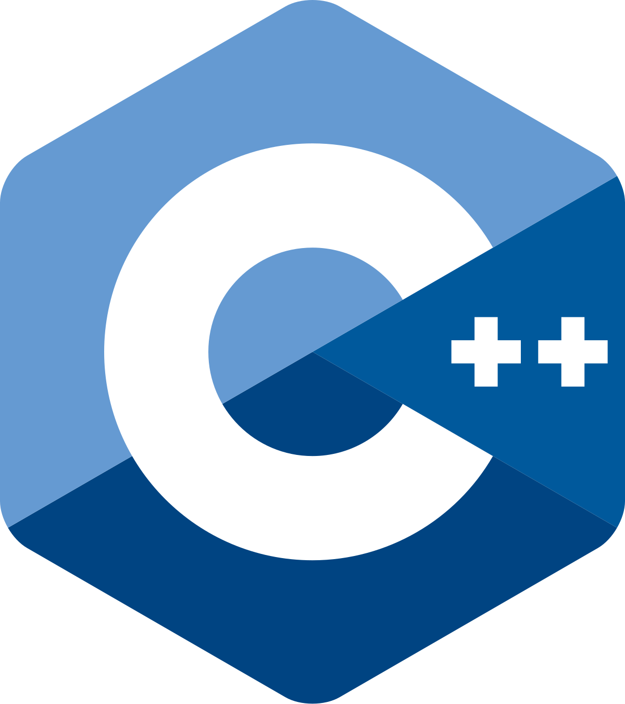
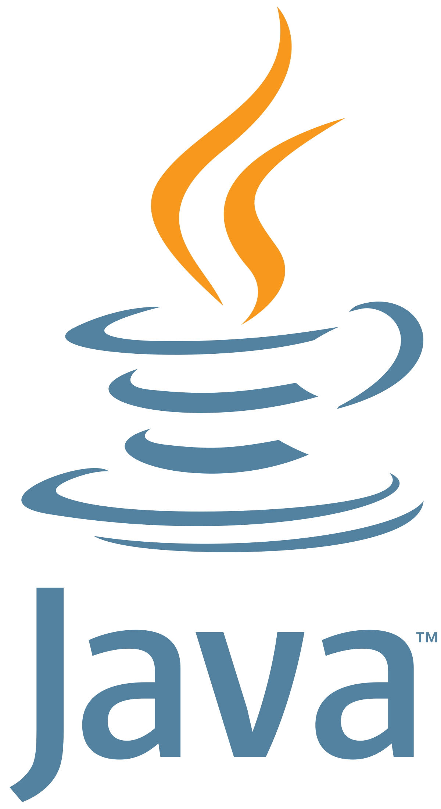
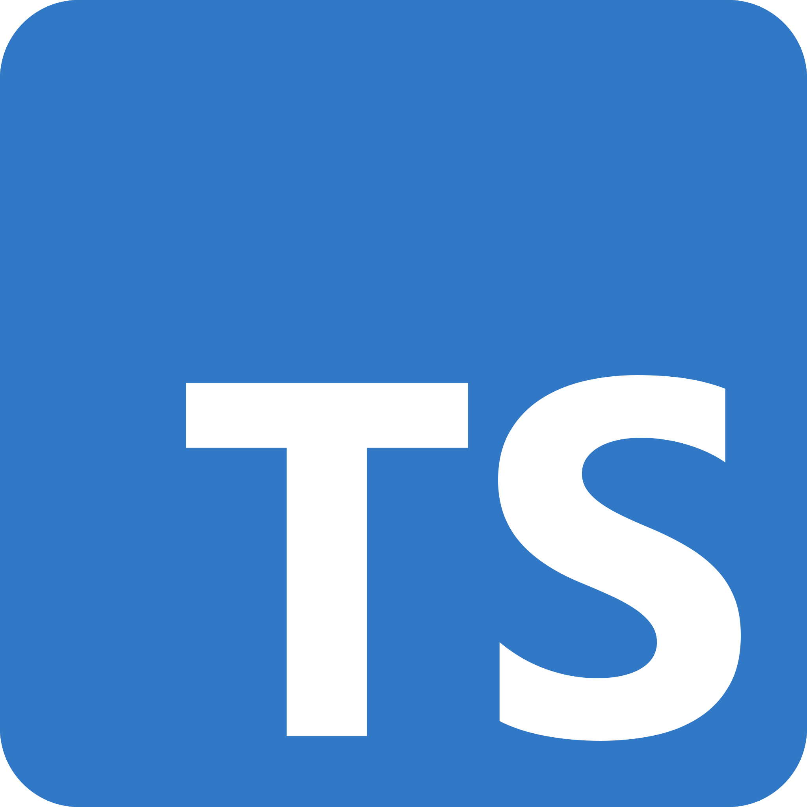
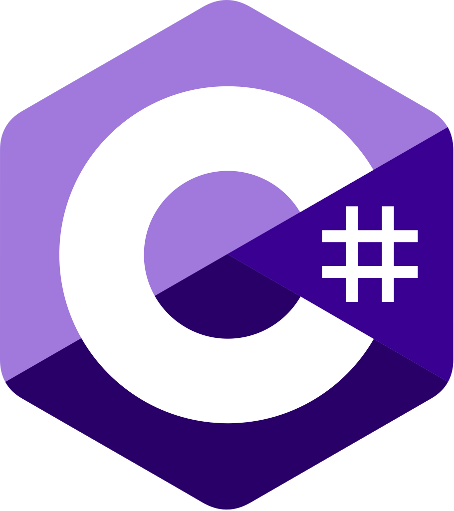
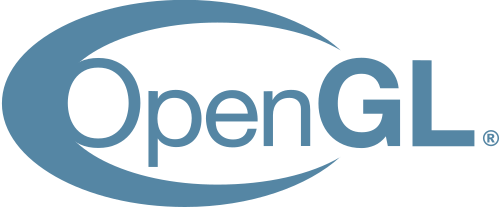
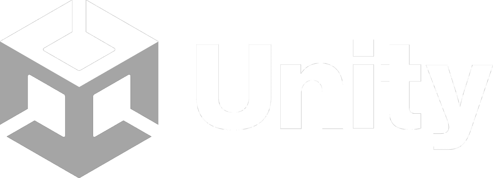

<h1 align="center">Hey there, I'm Owen!</h1>
<h3 align="center">I'm mainly interested in 3D graphics, game engines, systems programming, and robotics.</h3>

Pronouns: he/him  

Currently working on: [Cacao Engine](https://github.com/RobotLeopard86/CacaoEngine), a 3D game engine written in C++.  

I use [Svelte](https://svelte.dev) and [Vue.js](https://vuejs.org) for my occasional frontend projects.

If you have any issues or requests for any of my projects, open an issue or PR! I'll do my best to respond as quickly as possible.  

**GPG Fingerprint**: 0987 E6C0 2E97 7A7F BC26  98DD FC53 9F1A 8C05 9658.  
Please note, I only started using a signing key recently (February 2026). Older commits, tags, and the like will remain **unsigned**.

<h2 align="center">Languages</h2>

 
  
  &nbsp;&nbsp;&nbsp;&nbsp;&nbsp;&nbsp;&nbsp;&nbsp;
  
  &nbsp;&nbsp;&nbsp;&nbsp;&nbsp;&nbsp;&nbsp;&nbsp;
  
  &nbsp;&nbsp;&nbsp;&nbsp;&nbsp;&nbsp;&nbsp;&nbsp;
  

 

<h2 align="center">Frameworks & Tools</h2>

 
  
  &nbsp;&nbsp;&nbsp;&nbsp;&nbsp;&nbsp;&nbsp;&nbsp;
  
  &nbsp;&nbsp;&nbsp;&nbsp;&nbsp;&nbsp;&nbsp;&nbsp;
  
  &nbsp;&nbsp;&nbsp;&nbsp;&nbsp;&nbsp;&nbsp;&nbsp;
  
  &nbsp;&nbsp;&nbsp;&nbsp;&nbsp;&nbsp;&nbsp;&nbsp;
  
  &nbsp;&nbsp;&nbsp;&nbsp;&nbsp;&nbsp;&nbsp;&nbsp;
  
  &nbsp;&nbsp;&nbsp;&nbsp;&nbsp;&nbsp;&nbsp;&nbsp;

